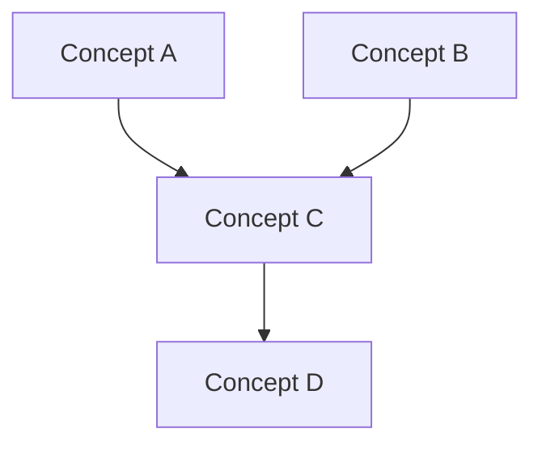

# [Course Title]

## Overview
[1-2 sentence description]

## Source Materials
- [file1.pdf] — covers [topics]
- [notes.md] — covers [topics]

## Concepts (ordered by prerequisite dependency)

### Tier 1: Foundations
- **Concept Name** — one-line description
  - Prerequisites: none
  - Key results: [theorems, algorithms, formulas]
  - Difficulty: 1-5
  - Implementable: yes/no

### Tier 2: Core
- **Concept Name** — one-line description
  - Prerequisites: [Concept A, Concept B]
  - Key results: [...]
  - Difficulty: 1-5
  - Implementable: yes/no

### Tier 3: Advanced
- **Concept Name** — one-line description
  - Prerequisites: [Concept C, Concept D]
  - Key results: [...]
  - Difficulty: 1-5
  - Implementable: yes/no

## Concept Dependency Graph

## Problem Style Guide

**Format**: [computational / conceptual / proof-based / mixed]
**Notation**: [describe notation conventions]
**Typical structure**: [how problems are usually framed]
**Difficulty scaling**: [what makes problems harder in this course]
